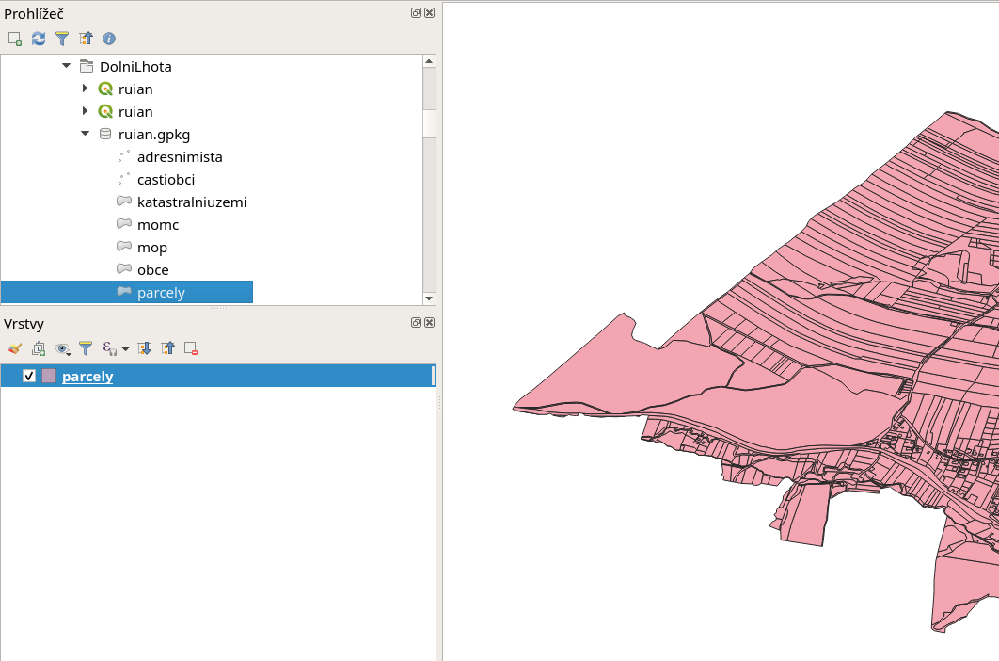

.. index::
   single: GeoPackage

GeoPackage
----------

GeoPackage je formát založený na Spatialite. Oproti Spatialite
přidává další struktury a to zejména metadata a také možnosti
uložení rastrových dat.

GeoPackage v QGIS - přístup 1
=============================

V prostředí nástroje QGIS se můžete na GeoPackage dívat
ze dvou pohledů. První z nich je jako na běžný zdroj dat.
Pak se pro vás nic nemění a tak jak demonstruje následující
obrázek přes např. prohlížeč načtete data.

           
   Načtení GeoPackage v QGIS

Na obrázku vidíme v prohlížeč s rozbaleným souborem ve formátu
GeoPackage s obsahem dat z RÚIAN.

GeoPackage v QGIS - přístup 2
=============================

Druhý pohled může být přes správce databází.
Zde můžete v plné síle využít dotazovací jazyk SQL,
včetně prostorových dotazů.

.. figure:: images/geopackage2.png
   :class: large

   Správce databází GeoPackage v QGIS

