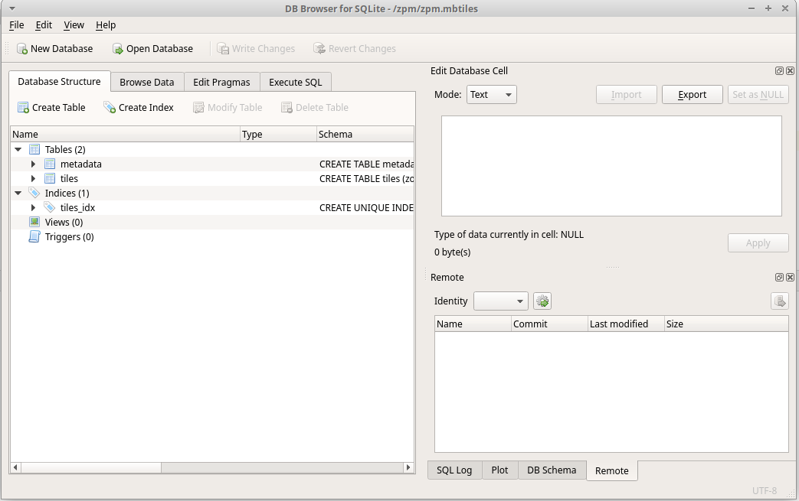

.. index::
   single: MBTiles

.. _wfs:

MBTiles
-------

Jiným příkladem uložení prostorových dat je struktura
Map Box Tiles, která umožňuje uložení dlaždic dat, a to
jak v rastrové nebo i vektorové formě.

Struktura
=========

Struktura databáze je jednoduchá. Jedná se o dvě tabulky a jeden index.

   Struktura MBTiles
