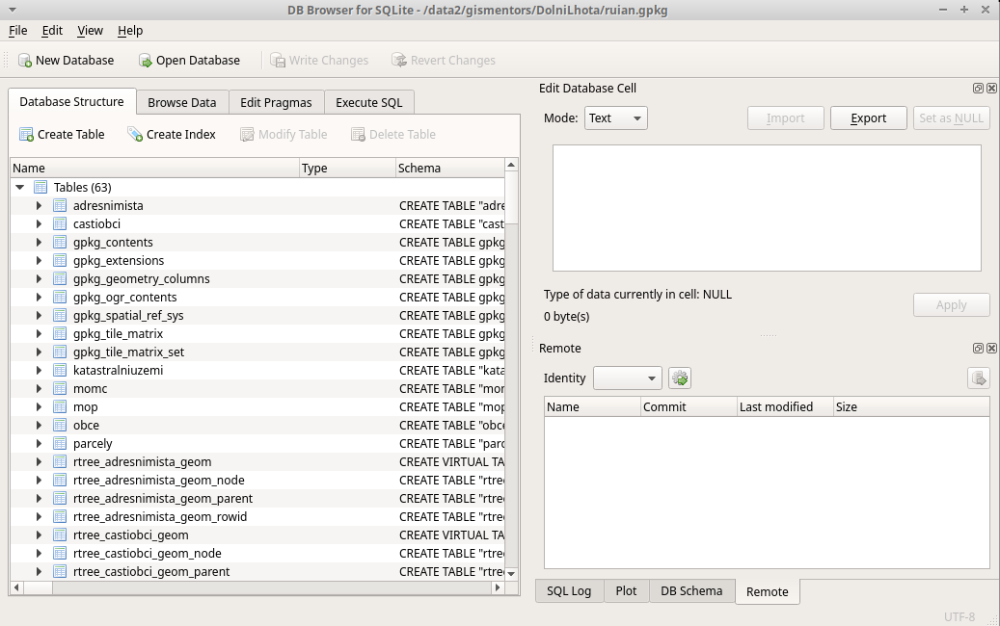
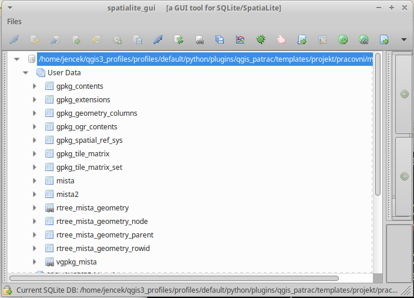

.. index::
   single: Spatialite

.. _wfs:

Spatialite
----------

Spatialite navazuje na oblíbené souborové řešení
SQLite a rozšiřuje funkcionalitu o základní prostorové dotazy a
operace dle standardu Simple Features Access.

.. tip:: Více o standardu Simple Features Access ve školení :skoleni:`PostGIS
         <postgis-zacatecnik/kapitoly/1_uvod.html>`.

SQLite
======

Již před příchodem SQLite existovaly souborové databáze. Jako příklad
můžeme uvést kdysi velmi oblíbený MS Access (JET). Výhoda souborového řešení
je zejména v tom, že můžeme kdykoli snadno komukoli naši databázi předat.
On si ji pak může snadno načíst.

V databázi je pak možné se dotazovat pomocí jazyka SQL (Structured Query Language)
nebo jiného jazyka.

   Prohlížeč DB Browser pro SQLite.

Spatialite
==========

Jak již bylo napsáno, tak Spatialite přidává možnost realizovat
prostorové dotazy nad daty. K tomu slouží prostorové indexy v databázi.
Samotné dotazy pak realizuje knihovna (ovladač), kterým se aplikace
k databázi připojuje.

           
   Prohlížeč spatialite-gui.
