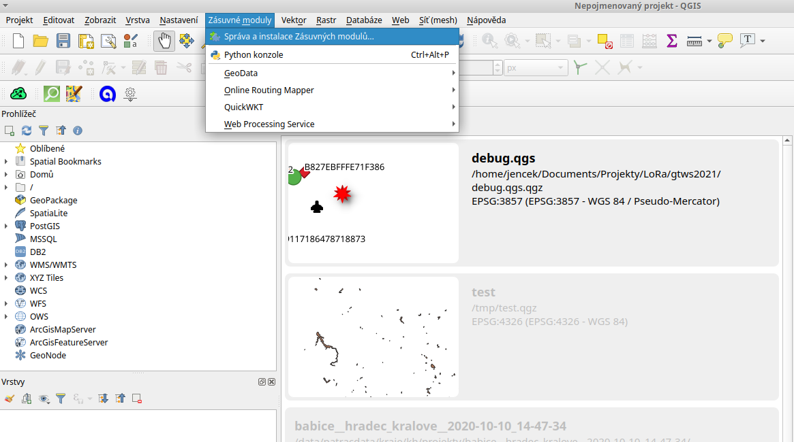
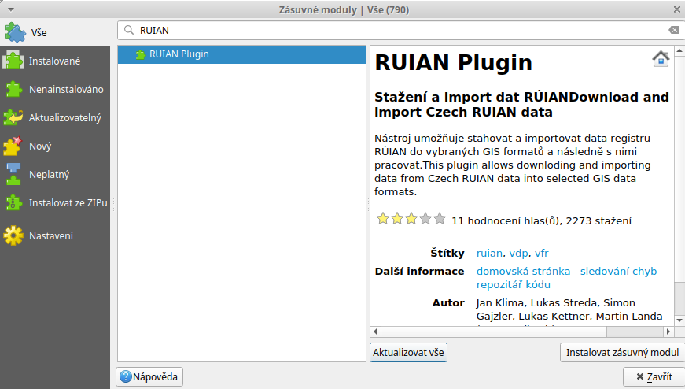
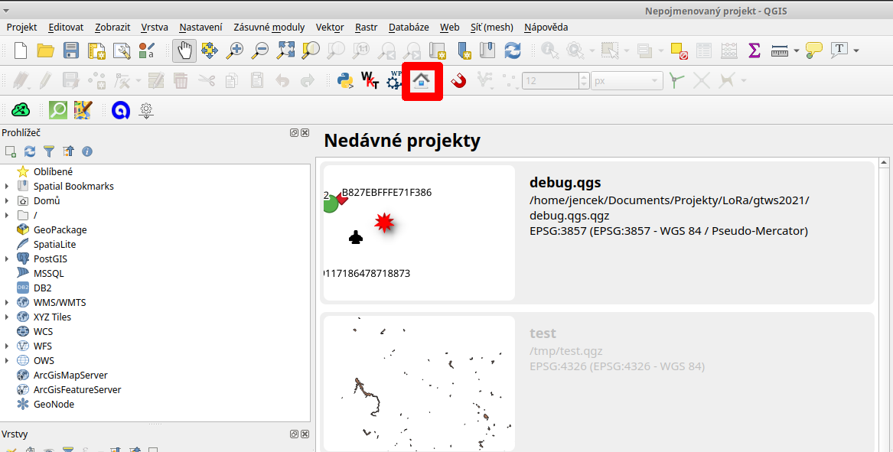
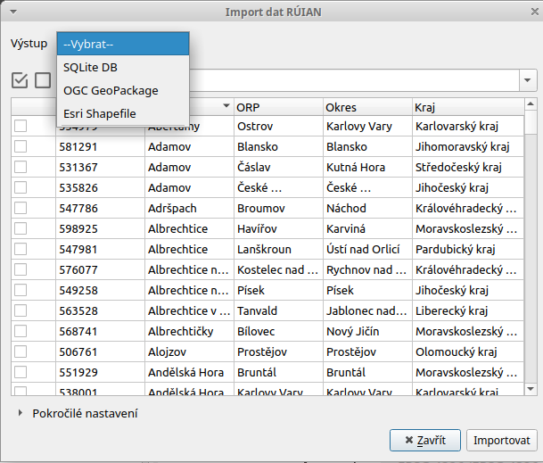
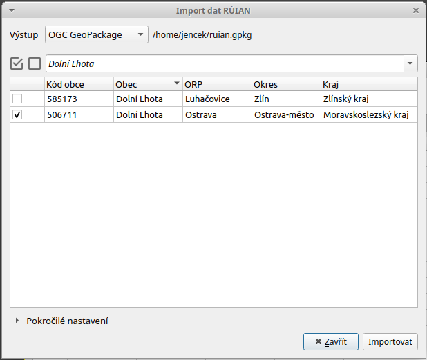
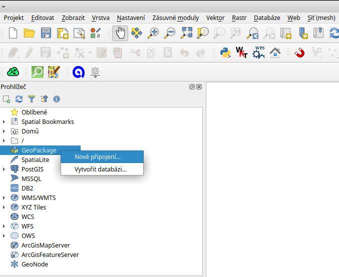
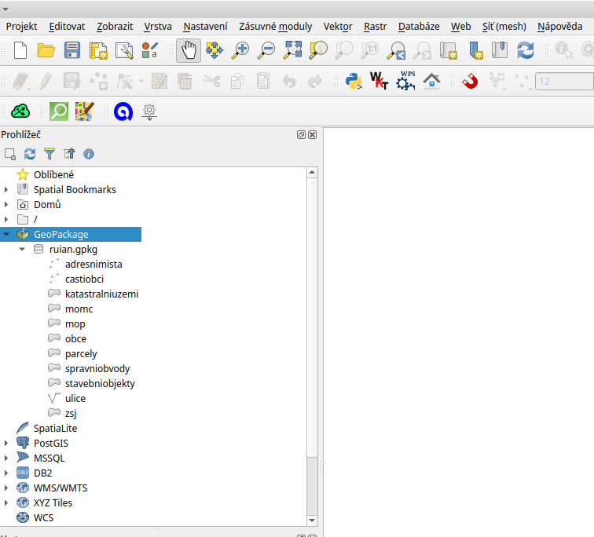

.. index::
   single: Úvod do prostorových databází

Úvod do prostorových databází
-----------------------------

Prostorová data můžeme ukládat v různé podobě.
Způsob uložení se velmi často liší v tom, zda se jedná o
reprezentaci v podobě rastru nebo vektoru, případně jiné struktury
a zda jde o 2D nebo 3D (ND) data.

Soubory bez indexace
====================

Velmi častý způsob uložení je v podobě souborů, které
často nemají žádnou doprovodnou informaci, tak aby bylo možné
nad daty provádět prostorové dotazy. Příkladem může být
třeba formát ESRI Shapefile, který v základu tvoří
tři soubory formátů SHP, SHX a DBF. Přestože je formát SHX
indexem, jde o index, který říká na kterém bajtu začínají a končí
souřadnice geometrie jednotlivých vektorových prvků. K prostorovému
dotazování tedy neslouží.

Soubory s indexací
==================

I soubory typu ESRI Shapefile je možné opatřit
prostorovým indexem. Díky tomu indexu je pak dotazování
výrazně rychlejší (např.
`GDAL <https://gdal.org/drivers/vector/shapefile.html>`_ vytváří soubory s
příponou `.sbn`). Soubor pro atributy - DBF - však žádnou indexaci neumožňuje.

Zatímco ESRI Shapefile očekává, že pro každý typ geometrie dat (body, line, polygony)
bude nutné mít několik souborů, existují řešení jako např. GeoPackage, které ukládají
data do jednoho souboru a to i v případě několika typů geoprvků.

Některé formáty však primárně indexy nemají a tedy je jejich
účel v zásadě jiný. Příkladem může být GML, který je spíše jazykem
a slouží pro výměnu geodat. U tohoto formátu si nejsme vědomi, že
by k němu bylo možné vytvářet index a je tedy vhodné jej nepoužívat
pro primární uložení geodat. Podobně je na tom (zejména na webu) populární
GeoJSON, GeoRSS a podobné.

Serverové prostorové databáze
=============================

Zatímco souborová řešení předpokládají přístup přímo k souborům,
serverová řešení soubory před uživateli schovávají za rozhraní.
Výhodou serverového řešení je zejména přístup více uživatelů
k datům a to včetně centrálně řešeného zabezpečení. Někteří uživatelé tak mohou
data pouze číst. Jiní mohou např. modifikovat vybraná data a
správci mohou provádět zálohy dat a přiřazovat práva.

Mezi známé zástupce této skupiny patří PostgreSQL/PostGIS,
Oracle, MSSQL nebo třeba i MongoDB a ElasticSearch.

Nevýhoda použití databázového serveru (centrálního řešení), je režije. Někdo
musí databázový systém nainstalovat, konfigurovat, udržovat, přidělovat
uživatelská práva, zálohovat, ...

Cloudové prostorové databáze
============================

Cloudové řešení může nabývat celé řady podob od cloud-optimized
systémů řízení báze dat až po clustery běžných serverových řešení. Jedná se
vlastně o standardní serverové prostorové databáze, provozované v některé z dnes
dostupných cloudových infrastruktur (Azure, Google, Amazon AWS, ...). Samozřejmě
pod databází existuje (virtuální) stroj, na kterém je databáze provozovaná. Ten
je ale optimalizovaný (co do konfigurace) pro běh databázových systémů. Cloudové
prostředí umožňuje (relativně) jednoduchou zálohu, škálování, dostupnost pro
určité síťové segmenty a tak podobně.

V rámci tohoto školení se této problematice věnovat nebudeme.

Rastry
======

Do prostorových databází - souborových i těch, které využívají architekturu
klient-server - lze ukládat i rastrová data. Toho je zhusta využíváno u
některých dlaždicových rastrových formátů, ale nejenom.

Výhoda uložení rastrů přímo do databáze je jednotná platforma pro jejich
zpracování (jazyk SQL). Z hlediska výkonu jsou "rastry v databázi" považovány za
relativně pomalé, což se ale časem zlepšuje.

Připojení prostorové databáze v QGIS
====================================

V této fázi je dobré se podívat jak se taková prostorová databáze připojuje
v prostředí nástroje QGIS.

Nejdříve si nainstalujeme zásuvný modul RÚIAN, abychom si snadno stáhli
existující data a uložili do formátu souborové prostorové geodatabáze.

Použijeme nabídku Zásuvné moduly / Správa a instalace zásuvných modulů.

   Instalace zásuvných modulů

Na dialogovém okně zadáme vyhledávat RUIAN a pak nalezený
plugin nainstalujeme.

   Instalace zásuvného modulu RUIAN

Na liště zásuvných modulů přibyde tlačítko pro spuštění tohoto modulu.

   Spuštění zásuvného modulu RUIAN

Po spuštění volíme uložení do OGC GeoPackage.

   Uložení do OGC GeoPackage v modulu RUIAN

Zadáme obec Dolní Lhota (u Ostravy) a dáme importovat.

   Import dat z obce Dolní Lhota

Pokud jsme na závěr importu zvolili vložení dat do mapy,
vidíme v mapě parcely a budovy obce Dolní Lhota.

Připojení prostorové databáze lze v nástroji QGIS realizovat
několika způsoby, ale zdá se, že nejlepší pokrytí různých
typů úložišť v tomto případě nabízí panel Prohlížeč.

Pokud klikneme v Prohlížeči pravým tlačítkem myši na některý z
typů úložišť prostorových databází dostaneme možnost vytvořit
Nové připojení. V příkladu dále na obrázku jsou úložiště: GeoPackage,
SpatiaLite, PostGIS, MSSQL a DB2.

Zvolíme GeoPackage a Nové připojení.

   Nové připojení GeoPackage

Vybereme v předchozím kroku uložený ruian.gpkg a máme připojeno.
V Prohlížeči pak můžeme procházet připojení a prohlížet si
tabulky této souborové databáze.

   Připojený GeoPackage v Prohlížeči

Takto realizované připojení můžeme pak využívat např. ve
Správci databází, kterého budeme používat dále.
