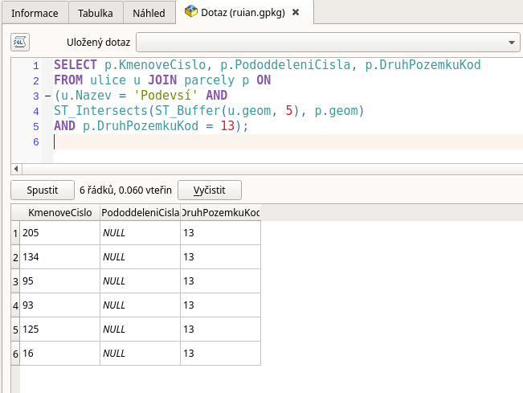

.. index::
   single: Příklady prostorových dotazů

Příklady prostorových dotazů
----------------------------

V této části se podíváme na další funkce, které můžete
v prostorových databázích využívat. Projdeme si je
na konkrétních příkladech.

ST_Distance
===========

Oblíbenou úlohou je hledání vztahu, do kterého vstupuje
obálka kolem geometrie. Např. nás může zajímat seznam stavebních
parcel, dokterých zasahuje obalová zóna kolem osy ulice Podevsí.

.. code-block:: sql

   SELECT p.KmenoveCislo, p.PododdeleniCisla, p.DruhPozemkuKod
   FROM ulice u JOIN parcely p ON
   (u.Nazev = 'Podevsí' AND
   ST_Intersects(ST_Buffer(u.geom, 5), p.geom)
   AND p.DruhPozemkuKod = 13);

   ST_Buffer

