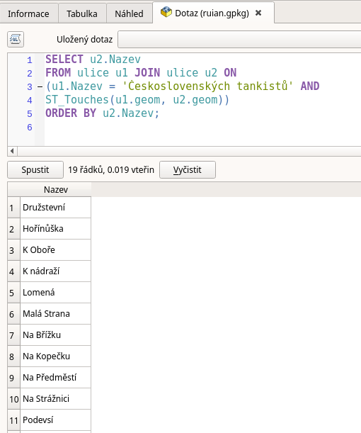

.. index::
   single: Příklady prostorových dotazů

Příklady prostorových dotazů
----------------------------

V této části se podíváme na další funkce, které můžete
v prostorových databázích využívat. Projdeme si je
na konkrétních příkladech.

ST_Distance
===========

Oblíbenou úlohou je hledání vztahu, do kterého vstupuje
obálka :sqlcmd:`ST_Buffer` kolem geometrie. Např. nás může zajímat seznam stavebních
parcel, do kterých zasahuje obalová zóna kolem osy ulice Podevsí.

.. code-block:: sql

   SELECT p.KmenoveCislo, p.PododdeleniCisla, p.DruhPozemkuKod
   FROM ulice u JOIN parcely p ON
   (u.Nazev = 'Podevsí' AND
   ST_Intersects(ST_Buffer(u.geom, 5), p.geom)
   AND p.DruhPozemkuKod = 13);

.. figure:: images/ssql6.png
   :class: large

   ST_Buffer

ST_Touches
==========

Jiným častým příkladem může být hledání sousedů. Zde je možno
využít funkci :sqlcmd:`ST_Touches`. Např. nás zajíají ulice,
které se napojují na ulici Československých tankistů.

.. code-block:: sql

   SELECT u2.Nazev
   FROM ulice u1 JOIN ulice u2 ON
   (u1.Nazev = 'Československých tankistů' AND
   ST_Touches(u1.geom, u2.geom))
   ORDER BY u2.Nazev;

   ST_Touches
