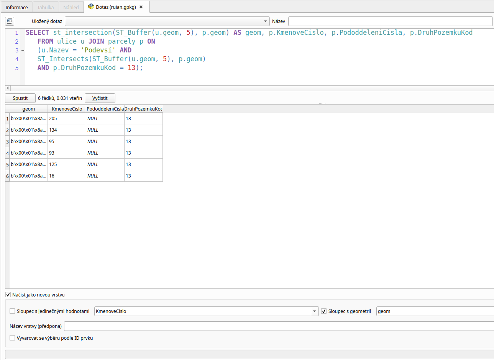
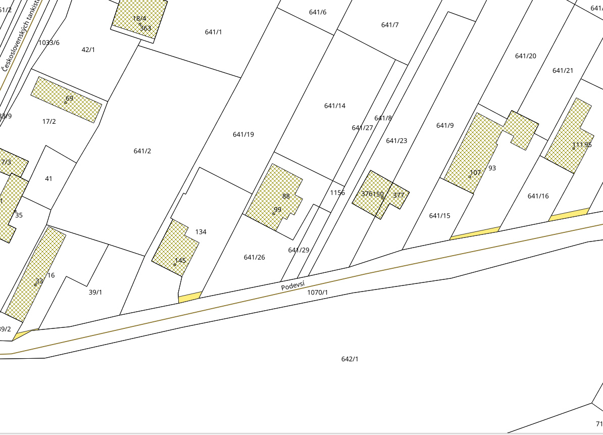
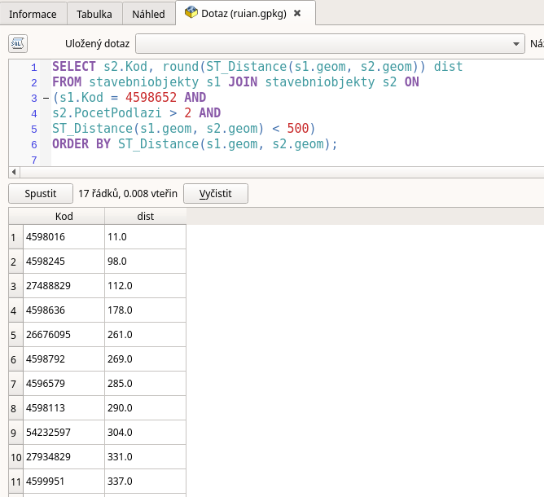

.. index::
   single: Příklady prostorových dotazů

Příklady prostorových dotazů
----------------------------

V této části se podíváme na další funkce, které můžete
v prostorových databázích využívat. Projdeme si je
na konkrétních příkladech.

ST_Buffer a ST_Intersects
=========================

Oblíbenou úlohou je hledání vztahu, do kterého vstupuje
obálka :sqlcmd:`ST_Buffer` kolem geometrie. Např. nás může zajímat seznam stavebních
parcel, do kterých zasahuje obalová zóna kolem osy ulice Podevsí.

.. code-block:: sql

   SELECT p.KmenoveCislo, p.PododdeleniCisla, p.DruhPozemkuKod
   FROM ulice u JOIN parcely p ON
   (u.Nazev = 'Podevsí' AND
   ST_Intersects(ST_Buffer(u.geom, 5), p.geom)
   AND p.DruhPozemkuKod = 13);

.. figure:: images/ssql6.png
   :class: large

   ST_Buffer

ST_Intersection
===============

Někdy nás může zajímat nejen zda se plochy překrývají, ale
zajímá nás i geometrie toho překryvu. V tomto případě tedy kromě
již použitých funkcí :sqlcmd:`ST_Buffer` a :sqlcmd:`ST_Intersects`
přidáme funkci ST_Intersection, která nám vrátí právě plochy toho
překryvu.

.. code-block:: sql

   SELECT ST_Intersection(ST_Buffer(u.geom, 5), p.geom) AS geom,
   p.KmenoveCislo, p.PododdeleniCisla, p.DruhPozemkuKod
   FROM ulice u JOIN parcely p ON
   (u.Nazev = 'Podevsí' AND
   ST_Intersects(ST_Buffer(u.geom, 5), p.geom)
   AND p.DruhPozemkuKod = 13);

   ST_Intersection

Výsledek dotazu můžeme přidat jako novou vrstvu do mapy.
Toto je podrobněji popsáno dále.

   Zobrazení výsledku ST_Intersection v mapě

Na obrázku jsou plochy vyzbačeny oranžovou barvou.

ST_Touches
==========

Jiným častým příkladem může být hledání sousedů. Zde je možno
využít funkci :sqlcmd:`ST_Touches`. Např. nás zajímají ulice,
které se napojují na ulici Československých tankistů.

.. code-block:: sql

   SELECT u2.Nazev
   FROM ulice u1 JOIN ulice u2 ON
   (u1.Nazev = 'Československých tankistů' AND
   ST_Touches(u1.geom, u2.geom))
   ORDER BY u2.Nazev;

.. figure:: images/ssql7.png
   :class: large

   ST_Touches

ST_Distance
===========

Jiným příkladem, kde se pracuje se vzdáleností je použití funkce
:sqlcmd:`ST_Distance`. Např. nás zajímají stavební objekty s počtem podlaží
větším než 2, tedy vyšší budovy do vzdálenosti 500 m od obecního úřadu (Kód 4598652),
na které bychom mohli umístit senzory hluku systému LoRa, tak aby mohly posílat
signál na bránu umístěnou na úřadě.

.. note:: Úloha je značně zjednodušená, protože neuvažujeme další parametry
   jako např. digitální model terénu

.. code-block:: sql

   SELECT s2.Kod, round(ST_Distance(s1.geom, s2.geom)) dist
   FROM stavebniobjekty s1 JOIN stavebniobjekty s2 ON
   (s1.Kod = 4598652 AND
   s2.PocetPodlazi > 2 AND
   ST_Distance(s1.geom, s2.geom) < 500)
   ORDER BY ST_Distance(s1.geom, s2.geom);

   ST_Distance
