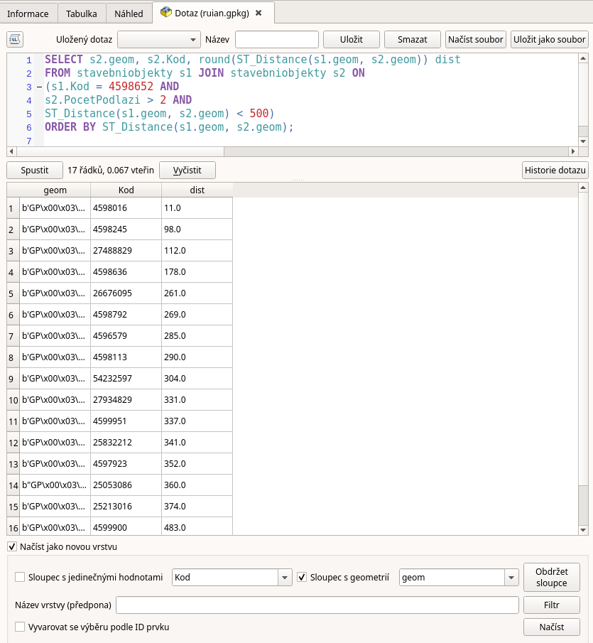
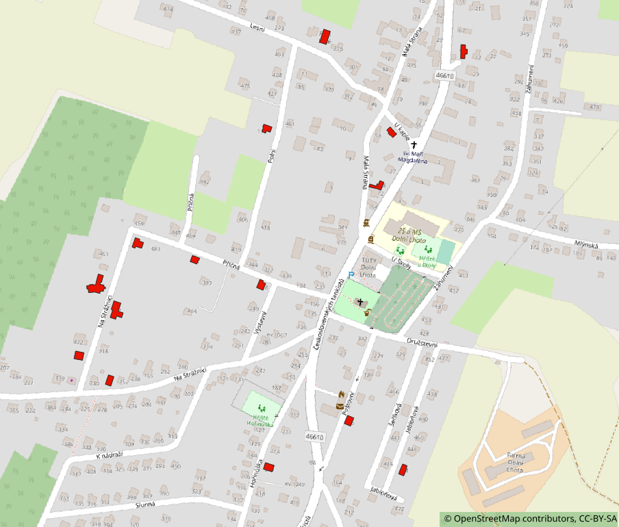

.. index::
   single: Použití prostorových dotazů v QGIS

Použití prostorových dotazů v QGIS
----------------------------------

Doposud uváděné dotazy až na jednu výjimku nevracely geometrii,
ale v rámci Správce databází je možné vrátit i geometrii
a výsledek načíst do mapy.

Načtení výsledku dotazu jako vrstvy
===================================

Pokud rozšíříme seznam atributů v dotazu o atribut geom
umožní nám dialog následně načíst data jako vrstvu.

.. code-block:: sql

   SELECT s2.geom, s2.Kod, round(ST_Distance(s1.geom, s2.geom)) dist
   FROM stavebniobjekty s1 JOIN stavebniobjekty s2 ON
   (s1.Kod = 4598652 AND
   s2.PocetPodlazi > 2 AND
   ST_Distance(s1.geom, s2.geom) < 500)
   ORDER BY ST_Distance(s1.geom, s2.geom);

   Rozšíření dotazu o geometrii a načtení jako vrstvy

Červeně jsou vykresleny budovy získané předchozím dotazem.

   Dotaz jako vrstva

.. TODO - další využití
