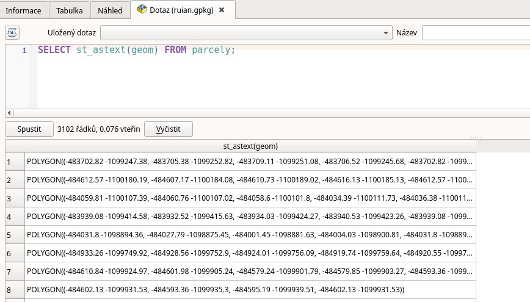
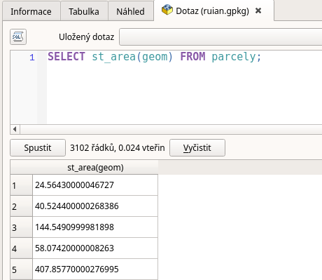
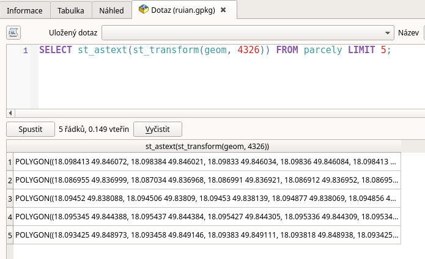
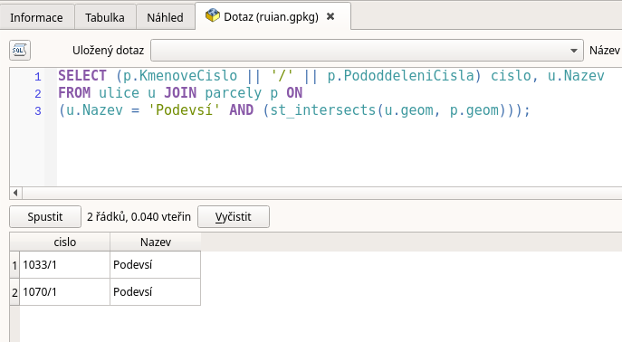
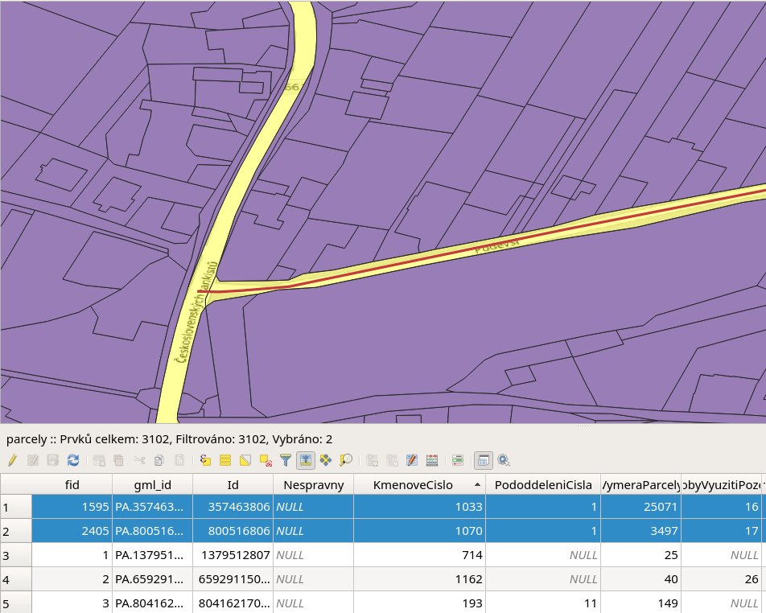

.. index::
   single: Úvod do prostorových dotazů

Úvod do prostorových dotazů
---------------------------

V rámci prostorových dotazů můžeme využívat celou řadu
funkcí a také operátory. V úvodu se podíváme na několik
funkcí a jeden operátor. Další funkce budou popsány
v píkladech.

Základní funkce
===============

Mezi základní funkce, se kterými se můžeme setkat jsou
funkce pro převody geometrií a základní informace o geometrii.

ST_AsText
^^^^^^^^^

Tato funkce slouží k zobrazení tzv. WKT (Well Known Text) zápisu
geometrie. Může nám pomoci ke kontrole obsahu, např. zda máme
očekávané souřadnice.

.. code-block:: sql

   SELECT st_astext(geom) FROM parcely;

   ST_AsText

ST_Area
^^^^^^^

Tato funkce slouží k výpočtu plochy polygonu.

.. code-block:: sql

   SELECT st_area(geom) FROM parcely;

   ST_Area

ST_Transform
^^^^^^^^^^^^

Tato funkce slouží k transformaci mezi souřadnicovými systémy.
V dotazu je použito klíčové slovo :sqlcmd:`LIMIT`, které omezí dotaz na uvedený
počet záznamů.

.. code-block:: sql

   SELECT st_astext(st_transform(geom, 4326)) FROM parcely LIMIT 5;

   ST_Transform

ST_Intersects
^^^^^^^^^^^^^

Tato funkce slouží k zjištění zda se dvě geometrie prostorově protínají.
Zde ji používáme v kombinaci dvou vrstev s využitím :sqlcmd:`JOIN`.
V příkladu také používáme operátor :sqlcmd:`||`, který slouží, k zřetězení
řetězců. Pomocí něj ze dvou atributů vytvoříme zápis parcelního čísla, tak jak
jej známe, tedy číslo / podlomení.

.. code-block:: sql

   SELECT (p.KmenoveCislo || '/' || p.PododdeleniCisla) cislo, u.Nazev
   FROM ulice u JOIN parcely p ON
   (u.Nazev = 'Podevsí' AND (ST_Intersects(u.geom, p.geom)));

   ST_Intersects

Výsledkem dotazu jsou dvě parcely, protože ulice zasahuje svou geometrií do
dvou parcel, tak jak je zobrazeno na dalším obrázku

   Parcely zasahující do osy ulice Podevsí
