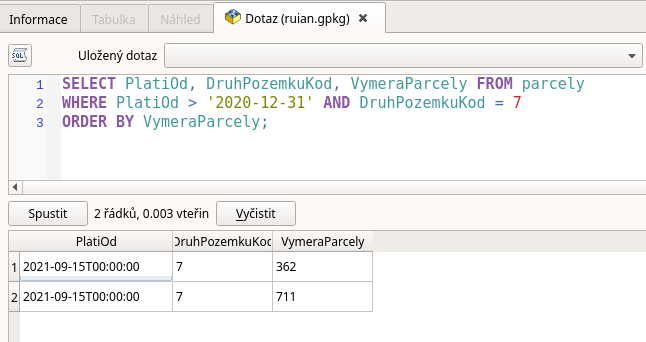

.. index::
   single: Atributy v SQL

Atributy v SQL
--------------

V úvodu jsme si ukázali, že můžeme požádat o atributy z tabulky.
Atributy však můžeme využít také k dotazování.

Podmínka
========

V jazyce SQL je možné tvořit podmínky. Slouží k tomu celá řada klíčových
slov a operátorů, ale základní je slovo :sqlcmd:`WHERE` a matematické operátory
jako je např. :sqlcmd:`=`.

Pokud tedy chceme vybrat např. parcely, typu Vodní tok, který má kód 7 zapíšeme takto

.. code-block:: sql

   SELECT DruhPozemkuKod, VymeraParcely FROM parcely WHERE DruhPozemkuKod = 7;

.. figure:: images/sql2.png
   :class: large

   Dotaz na parcely typu Vodní tok z RÚIAN v QGIS

Pokud chceme např. vybrat parcely, které mají rozlohu větší než 10 ha, napíšeme

.. code-block:: sql

   SELECT DruhPozemkuKod, VymeraParcely FROM parcely WHERE VymeraParcely > 100000;

.. figure:: images/sql3.png
   :class: large

   Dotaz na parcely větší než 10 ha z RÚIAN v QGIS

Specifickým způsobem se ohraničují hodnoty atributů typu text (řetězec) a datum.
Tyto hodnoty se uvozují jednoduchými uvozovkami.

Pokud tedy chceme získat záznamy, které platí od roku 2021, tedy v roce 2021 došlo na
parcele ke změně nebo nově vznikla, ptáme se takto.

.. code-block:: sql

   SELECT PlatiOd, DruhPozemkuKod, VymeraParcely FROM parcely WHERE PlatiOd > '2020-12-31';

.. figure:: images/sql4.png
   :class: large

   Dotaz na parcely se záznamem v roce 2021 z RÚIAN v QGIS

Další užitečná klíčová slova a výrazy
=====================================

Mezi často používaná klíčová slova patří :sqlcmd:`ORDER BY`,
:sqlcmd:`AND`, :sqlcmd:`OR`, :sqlcmd:`NOT` a :sqlcmd:`()`

Pomocí :sqlcmd:`ORDER BY` můžeme záznamy řadit dle vybraného atributu,
atributů nebo výrazu.

Pomocí operátorů :sqlcmd:`AND`, :sqlcmd:`OR`, :sqlcmd:`NOT` a :sqlcmd:`()`
můžeme sestavovat logické kombinace podmínek.

Pokud nás tedy třeba zajímají parcely, které mají změnu v roce 2021 a jsou
to Vodní toky, můžeme je vybrat takto a seřadit podle výměry.

.. code-block:: sql

   SELECT PlatiOd, DruhPozemkuKod, VymeraParcely FROM parcely
   WHERE PlatiOd > '2020-12-31' AND DruhPozemkuKod = 7
   ORDER BY VymeraParcely;

   Dotaz na parcely typu Vodní tok se záznamem v roce 2021 z RÚIAN v QGIS
   seřazené dle výměry.

Výrazy můžeme zapisovat na různá místa v dotazu a můžeme používat i celou
řadu funkcí. Jako příklad uvedeme jeden výraz a funkci :sqlcmd:`MAX`, která nám vypíše
maximální výměru v území v hektarech.

.. code-block:: sql

   SELECT MAX(VymeraParcely) / 10000 FROM parcely;

.. figure:: images/sql7.png
   :class: large

   Maximální výměra v hektarech
