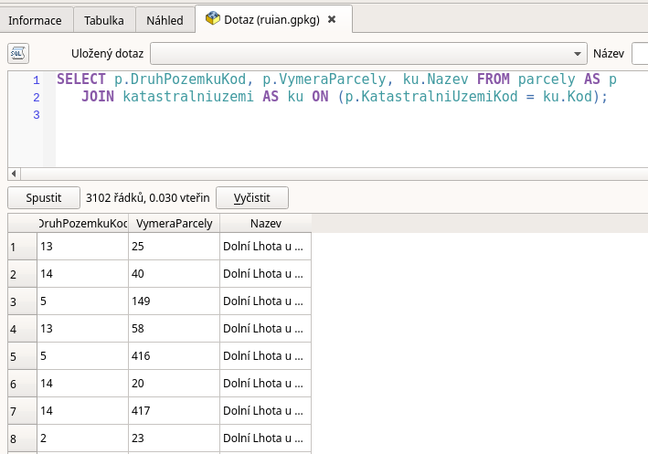

.. index::
   single: Vazby v SQL

Vazby v SQL
-----------

Jednou ze zásadních vlastností databází, která využívají SQL, je
možnost propojování tabulek mezi sebou. Možností propojení je celá řada.
My si zde pro zjednodušení ukážeme nejednodušší vazbu, takzvané přirozené
spojení.

Přirozené spojení
=================

V tabulce parcely, kterou už trochu známe, máme atribut KatastralniUzemiKod.
V tabulce, ale chybí název katastrálního území. Ten je ale v tabulce
katastralniuzemi. Pro spojení těchto dvou tabulek použijeme
klíčová slova :sqlcmd:`JOIN` a :sqlcmd:`ON` a operátor :sqlcmd:`=`.
V kódu ještě používáme klíčové slovo :sqlcmd:`AS`, které slouží k definování
aliasu pro název tabulky, aby výsledký kód nebyl extrémně dlouhý, případně k
jiným operacím (třeba ke virtuálním spojení tabulky se sebou samou). Klíčové
slovo :sqlcmd:`AS` je možno vynechat.

.. code-block:: sql

   SELECT p.DruhPozemkuKod, p.VymeraParcely, ku.Nazev FROM parcely AS p
   JOIN katastralniuzemi AS ku ON (p.KatastralniUzemiKod = ku.Kod);

   Přirozené spojení

Výsledkem tohoto dotazu je seznam parcel i s názvem katastrálního území.
