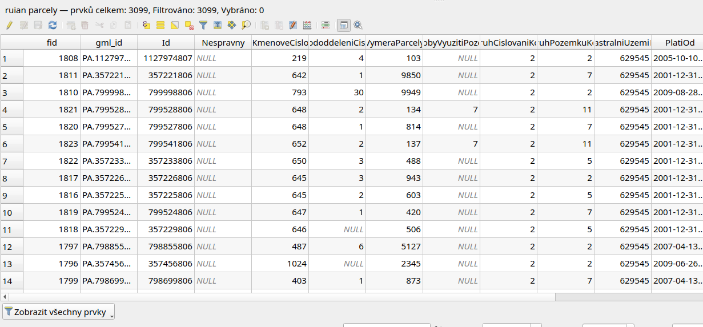
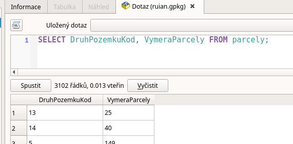

.. index::
   single: Úvod do SQL

Úvod do SQL
-----------

Jazyk SQL může být i poměrně složitý, my se však podíváme
jen na velmi omezenou množinu toho co se s jazykem dá dělat.

Tabulka
=======

Tabulka v jazyce SQL (správně označovaná jako relace - bavíme se o tzv.
relačních databázích) sestává
z řádků. Každý řádek reprezentuje objekt. Objekt je popsán
atributy a jejich hodnoty jsou uloženy ve sloupcích (buňkách)
tabulky.

   Tabulka (relace)

Struktura dotazu
================

Dotaz pokládáme velmi jednoduše. Ptáme se takto:

Vyber mi tyto atributy z této tabulky.

V jazyce SQL pak zapíšeme pomocí klíčových slov :sqlcmd:`SELECT` a :sqlcmd:`FROM`.

Celý zápis pak vypadá takto:

.. code-block:: sql

   SELECT atribut1, atribut2 FROM tabulka;

Příklad výběru objektů z tabulky parcely databáze RÚIAN.

.. code-block:: sql

   SELECT DruhPozemkuKod, VymeraParcely FROM parcely;

   Dotaz na parcely z RÚIAN v QGIS
